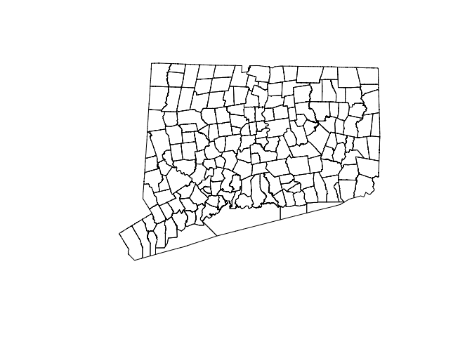
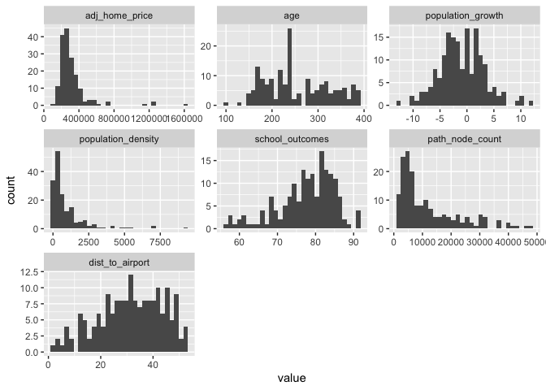
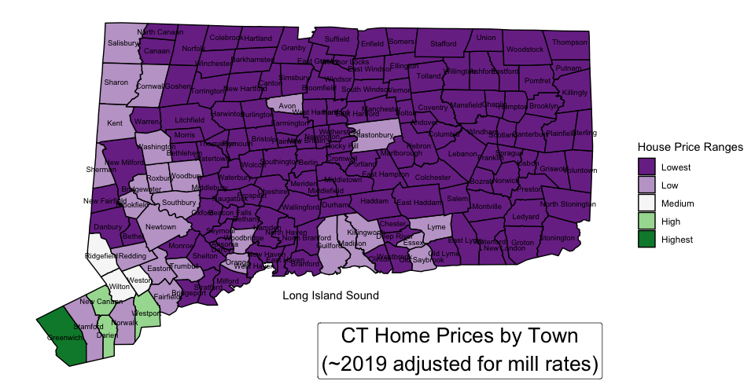
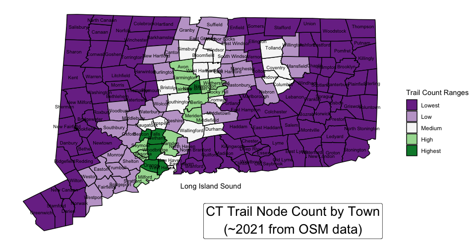
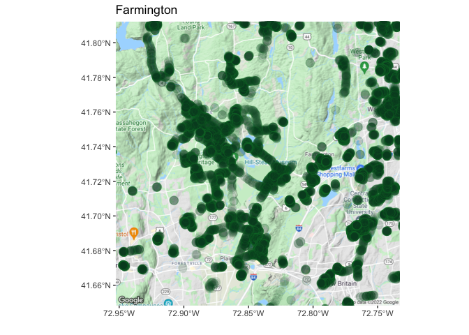
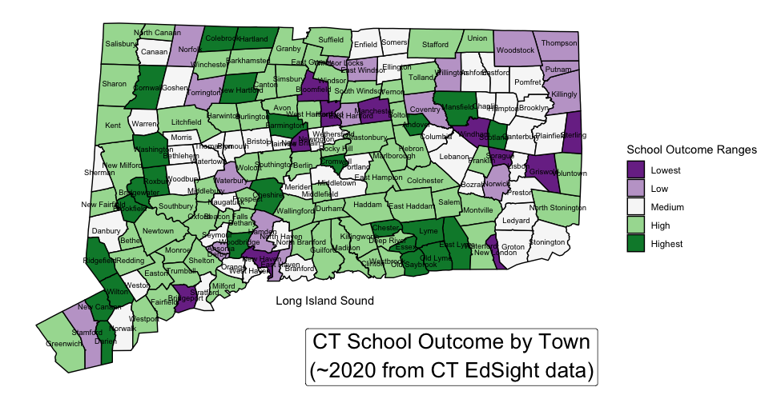
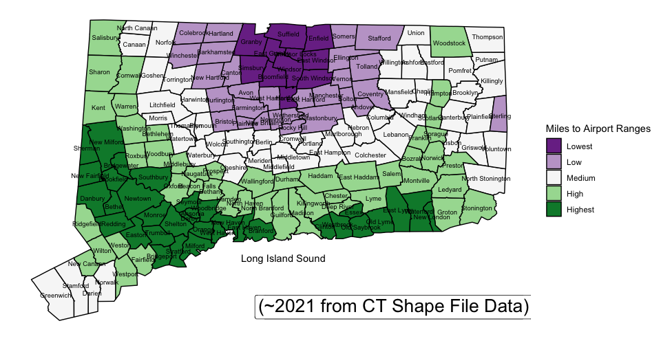
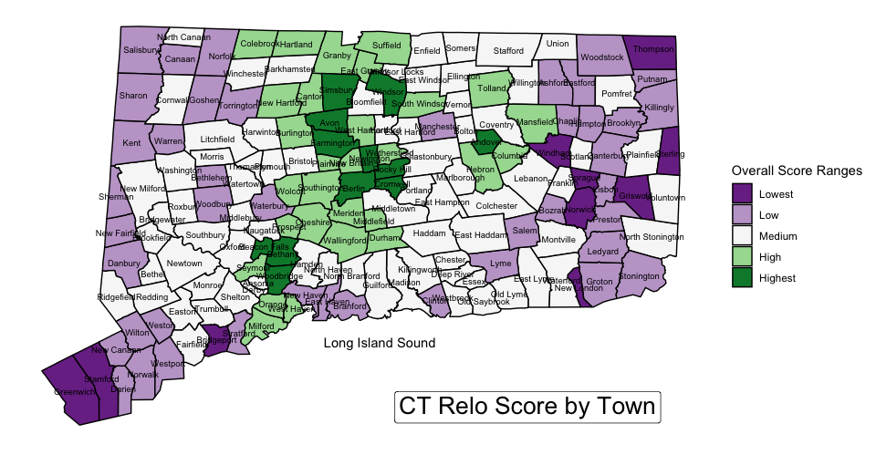

CT-Relo-Project
================
frank-corrigan
1/3/2022

## Background

Document to reproduce metrics and visualizations used in this article:
<http://www.frank-corrigan.com/2022/01/03/where-should-we-live/>

First order is to load disperate data files (including shape files for
maps)…

``` r
# school data
# https://edsight.ct.gov/SASStoredProcess/guest?_program=%2FCTDOE%2FEdSight%2FRelease%2FReporting%2FPublic%2FReports%2FStoredProcesses%2FNGAReport&_district=State%20of%20Connecticut&_select=Submit&_year=2018-19&_school=
# house prices data
# 
# https://portal.ct.gov/OPM/IGPP/Publications/Mill-Rates
# this file actually includes additional data points:
school_data <- read.csv("CT-school-and-other.csv")
print(head(school_data))
```

    ##       NAME00 adj_home_price age population_growth land_area population_density
    ## 1     Bethel       346477.1 166               9.5      16.8             1212.5
    ## 2 Bridgeport       204516.2 200               3.1      16.0             9290.9
    ## 3 Brookfield       380106.9 233               6.5      19.8              885.3
    ## 4    Danbury       322152.6 334               7.0      42.1             2054.6
    ## 5     Darien      1271050.0 201               3.7      12.9             1671.8
    ## 6     Easton       567792.5 176               1.5      27.4              277.4
    ##   school_outcomes
    ## 1            82.4
    ## 2            59.7
    ## 3            85.0
    ## 4            75.0
    ## 5            88.7
    ## 6            81.4

``` r
# path to shape file
# https://magic.lib.uconn.edu/connecticut_data.html
path_to_shape <- "/WGS84/townct_37800_0000_2000_s100_census_1_shp_wgs84.shp"

# load shape file data
my_spdf <- readOGR( 
  dsn= paste0(getwd(), path_to_shape),
  verbose=FALSE
)

plot(my_spdf)
```

<!-- -->

## Getting Trails Data

You can also embed plots, for example:

``` r
##  NOTE: commenting out this section -
##  no need to do the loop again unless you want to update the data or search for different tags (like beaches)

## subset towns and locatins to pull osm data for...
# data_for_osm <- my_spdf@data %>% filter(NAME00 != "County subdivisions not defined") %>% select(NAME00, INTPTLAT00, INTPTLON00)

## instead of writing the long form several times below
# towns <- data_for_osm@data$NAME00
# lats <- data_for_osm$INTPTLAT00
# lons <- data_for_osm$INTPTLON00

## create an empty dataframe
# trail_df <- data.frame(town=NULL, path_node_count=NULL)

## loop through towns and use osm API to get nodes tagged as footway or cycleway
# for (i in 1:length(towns)) {
#
#   # set coords & location: from each town center, search ~10 mile radius..
#   coords <- matrix(c(lons[i] - 0., lons[i] + 0.16, lats[i] - 0.16, lats[i] + 0.16), byrow = TRUE, nrow = 2, ncol = 2, dimnames = list(c('x','y'),c('min','max')))
#   location <- coords %>% opq()
#
#   # get trail node data
#   temp_data <- location %>%
#     add_osm_feature(key = "highway",
#                     value = c("footway", "cycleway")) %>%
#     osmdata_sf()
#
#   # count path node count & create dataframe
#   temp_node_count <- nrow(temp_data$osm_points)
#   temp_df <- data.frame(town=towns[i], path_node_count=temp_node_count)
#
#   # agg datasets
#   trail_df <- rbind(trail_df, temp_df)
#
# }

# print(head(trail_df))

trail_df <- read.csv("osm_path_node_count.csv")
```

## Getting Distance to Airport Data

``` r
# lat/lon major airports around CT
lga <- c(-73.8740, 40.7769)
jfk <- c(-73.7781, 40.6413)
bdl <- c(-72.6860, 41.9389)
pvd <- c(-71.4270, 41.7235)
bos <- c(-71.0096, 42.3656)

# lat/lon needs to be numeric
my_spdf@data$INTPTLAT00 <- as.numeric(my_spdf@data$INTPTLAT00)
my_spdf@data$INTPTLON00 <- as.numeric(my_spdf@data$INTPTLON00)

# for each town (i.e. row of data), use the lowest distance to any airport
my_spdf@data$dist_lga <- distHaversine(as.matrix(my_spdf@data[,c("INTPTLON00", "INTPTLAT00")]), lga) * 0.000621371
my_spdf@data$dist_jfk <- distHaversine(as.matrix(my_spdf@data[,c("INTPTLON00", "INTPTLAT00")]), jfk) * 0.000621371
my_spdf@data$dist_bdl <- distHaversine(as.matrix(my_spdf@data[,c("INTPTLON00", "INTPTLAT00")]), bdl) * 0.000621371
my_spdf@data$dist_pvd <- distHaversine(as.matrix(my_spdf@data[,c("INTPTLON00", "INTPTLAT00")]), pvd) * 0.000621371
my_spdf@data$dist_bos <- distHaversine(as.matrix(my_spdf@data[,c("INTPTLON00", "INTPTLAT00")]), bos) * 0.000621371
my_spdf@data$dist_to_airport <- apply(my_spdf@data[,c("dist_lga", "dist_jfk", "dist_bdl", "dist_pvd", "dist_bos")], 1, FUN = min)
```

## Distributions

``` r
# first, bring the data together... 
my_spdf@data <- left_join(my_spdf@data, school_data, by="NAME00") %>%
  left_join(trail_df, by=c("NAME00"="town"))

# these are the columns we want to peek at
plot_dist_data <- my_spdf@data %>% select(adj_home_price, age, population_growth,
                                          population_density, school_outcomes, path_node_count,
                                          dist_to_airport)

library(reshape2)
```

    ## 
    ## Attaching package: 'reshape2'

    ## The following object is masked from 'package:tidyr':
    ## 
    ##     smiths

``` r
plot_dist_data_melt <- melt(plot_dist_data)
```

    ## No id variables; using all as measure variables

``` r
# finally, plot histograms
ggplot(plot_dist_data_melt, aes(x=value)) + geom_histogram() + facet_wrap(~variable, scales="free")
```

    ## `stat_bin()` using `bins = 30`. Pick better value with `binwidth`.

    ## Warning: Removed 24 rows containing non-finite values (stat_bin).

<!-- -->

## Setting Up for Maps!

``` r
# create lists for colors and range names
col_list <- c("#7b3294", "#c2a5cf", "#f7f7f7", "#a6dba0", "#008837")
labels_list <- c("Lowest", "Low", "Medium", "High", "Highest")

# add id field (allows for join to fortified df when creating maps)
my_spdf@data$id <- 0:(dim(my_spdf@data)[1]-1) 
```

## House Prices

``` r
# create dataset for map visualization
World2 <- fortify(my_spdf)
```

    ## Regions defined for each Polygons

``` r
World2_join = plyr::join(x = World2, y = my_spdf@data, by="id") # join by id
World2_join <- World2_join %>% filter(NAME00 != "County subdivisions not defined")
World2_join$cost_bucket <- cut(World2_join$adj_home_price, 6)

ggplot() + 
  geom_polygon(data = World2_join, aes(x = long, y = lat, group = group, fill = cost_bucket), # fill by OCCURENCE
               colour = "black", size = 0.5) +
  scale_color_manual(values = col_list, labels = labels_list) +
  scale_fill_manual(values = col_list, labels = labels_list) +
  geom_text(data=my_spdf@data %>% filter(NAME00 != "County subdivisions not defined"), aes(INTPTLON00, INTPTLAT00, label = NAME00), size=2.5) +
  labs(fill="House Price Ranges") +
  annotate("label", x = -72.25, y = 41, size = 7, label = expression(atop("CT Home Prices by Town", "(~2019 adjusted for mill rates)"))) +
  annotate("text", x = -72.70, y = 41.18, label = "Long Island Sound") +
  theme(panel.background = element_blank(),
      axis.title=element_blank(),
      axis.text=element_blank(),
      axis.ticks=element_blank())
```

    ## Warning in is.na(x): is.na() applied to non-(list or vector) of type
    ## 'expression'

<!-- -->

## Trail Systems

``` r
# create dataset for map visualization
World2 <- fortify(my_spdf)
```

    ## Regions defined for each Polygons

``` r
World2_join = plyr::join(x = World2, y = my_spdf@data, by="id") # join by id
World2_join <- World2_join %>% filter(NAME00 != "County subdivisions not defined")
World2_join$cost_bucket <- cut(World2_join$path_node_count, 5)

ggplot() + 
  geom_polygon(data = World2_join, aes(x = long, y = lat, group = group, fill = cost_bucket), # fill by OCCURENCE
               colour = "black", size = 0.5) +
  scale_color_manual(values = col_list, labels = labels_list) +
  scale_fill_manual(values = col_list, labels = labels_list) +
  geom_text(data=my_spdf@data %>% filter(NAME00 != "County subdivisions not defined"), aes(INTPTLON00, INTPTLAT00, label = NAME00), size=2.5) +
  labs(fill="Trail Count Ranges") +
  annotate("label", x = -72.25, y = 41, size = 7, label = expression(atop("CT Trail Node Count by Town", "(~2021 from OSM data)"))) +
  annotate("text", x = -72.70, y = 41.18, label = "Long Island Sound") +
  theme(panel.background = element_blank(),
      axis.title=element_blank(),
      axis.text=element_blank(),
      axis.ticks=element_blank())
```

    ## Warning in is.na(x): is.na() applied to non-(list or vector) of type
    ## 'expression'

<!-- -->

``` r
# get centerpoints for town of interest
guilford <- c(-72.70609, 41.33903)
farmington <- c(-72.84305, 41.73042)
the_spot <- farmington

# define "radius" from which to count trail system nodes
coords <- matrix(c(the_spot[1] - 0.16, the_spot[1] + 0.16, the_spot[2] - 0.16, the_spot[2] + 0.16), byrow = TRUE, nrow = 2, ncol = 2, dimnames = list(c('x','y'),c('min','max')))
location <- coords %>% opq()

# get data from osm
data <- location %>%
  add_osm_feature(key = "highway", 
                  value = c("footway", "cycleway")) %>%
  osmdata_sf()

# register_google(key = "Aanrq39hrf7rabgwegs-adsfawe") # note this is random key (i.e. not real - get a Google Maps API credential and Enable Static Maps from Google Console)
# has_google_key()

mad_map <- get_map(location = c(lon = the_spot[1], lat = the_spot[2]), zoom = 12)
```

    ## Source : https://maps.googleapis.com/maps/api/staticmap?center=41.73042,-72.84305&zoom=12&size=640x640&scale=2&maptype=terrain&language=en-EN&key=xxx-cboocD4QvIxVJxCvAt2c-CDETEUmUY

``` r
# final map
ggmap(mad_map)+
  geom_sf(data = data$osm_points,
          inherit.aes = FALSE,
          colour = "#238443",
          fill = "#004529",
          alpha = .1,
          size = 4,
          shape = 21) +
  labs(x = "", y = "", title = "Farmington") 
```

    ## Coordinate system already present. Adding new coordinate system, which will replace the existing one.

<!-- -->

## School Outcomes

``` r
# create dataset for map visualization
World2 <- fortify(my_spdf)
```

    ## Regions defined for each Polygons

``` r
World2_join = plyr::join(x = World2, y = my_spdf@data, by="id") # join by id
World2_join <- World2_join %>% filter(NAME00 != "County subdivisions not defined")
World2_join$cost_bucket <- cut(World2_join$school_outcomes, 5)

ggplot() + 
  geom_polygon(data = World2_join, aes(x = long, y = lat, group = group, fill = cost_bucket), # fill by OCCURENCE
               colour = "black", size = 0.5) +
  scale_color_manual(values = col_list, labels = labels_list) +
  scale_fill_manual(values = col_list, labels = labels_list) +
  geom_text(data=my_spdf@data %>% filter(NAME00 != "County subdivisions not defined"), aes(INTPTLON00, INTPTLAT00, label = NAME00), size=2.5) +
  labs(fill="School Outcome Ranges") +
  annotate("label", x = -72.25, y = 41, size = 7, label = expression(atop("CT School Outcome by Town", "(~2020 from CT EdSight data)"))) +
  annotate("text", x = -72.70, y = 41.18, label = "Long Island Sound") +
  theme(panel.background = element_blank(),
      axis.title=element_blank(),
      axis.text=element_blank(),
      axis.ticks=element_blank())
```

    ## Warning in is.na(x): is.na() applied to non-(list or vector) of type
    ## 'expression'

<!-- -->

## Proximity to Airport

``` r
# create dataset for map visualization
World2 <- fortify(my_spdf)
```

    ## Regions defined for each Polygons

``` r
World2_join = plyr::join(x = World2, y = my_spdf@data, by="id") # join by id
World2_join <- World2_join %>% filter(NAME00 != "County subdivisions not defined")
World2_join$cost_bucket <- cut(World2_join$dist_to_airport, 5)

ggplot() + 
  geom_polygon(data = World2_join, aes(x = long, y = lat, group = group, fill = cost_bucket), # fill by OCCURENCE
               colour = "black", size = 0.5) +
  scale_color_manual(values = col_list, labels = labels_list) +
  scale_fill_manual(values = col_list, labels = labels_list) +
  geom_text(data=my_spdf@data %>% filter(NAME00 != "County subdivisions not defined"), aes(INTPTLON00, INTPTLAT00, label = NAME00), size=2.5) +
  labs(fill="Miles to Airport Ranges") +
  annotate("label", x = -72.25, y = 41, size = 7, label = expression("CT Distance to Airport by Town", "(~2021 from CT Shape File Data)")) +
  annotate("text", x = -72.70, y = 41.18, label = "Long Island Sound") +
  theme(panel.background = element_blank(),
        axis.title=element_blank(),
        axis.text=element_blank(),
        axis.ticks=element_blank())
```

    ## Warning in is.na(x): is.na() applied to non-(list or vector) of type
    ## 'expression'

<!-- -->
\#\# Putting it All Together

``` r
my_spdf@data$score <- scale(my_spdf@data$school_outcomes) * 0.35 +
  scale(my_spdf@data$path_node_count) * 0.35 -
  scale(my_spdf@data$adj_home_price) * 0.2 -
  scale(my_spdf@data$dist_to_airport) * 0.1

# create dataset for map visualization
World2 <- fortify(my_spdf)
```

    ## Regions defined for each Polygons

``` r
World2_join = plyr::join(x = World2, y = my_spdf@data, by="id") # join by id
World2_join <- World2_join %>% filter(NAME00 != "County subdivisions not defined")
World2_join$cost_bucket <- cut(World2_join$score, 5)

ggplot() + 
  geom_polygon(data = World2_join, aes(x = long, y = lat, group = group, fill = cost_bucket), # fill by OCCURENCE
               colour = "black", size = 0.5) +
  scale_color_manual(values = col_list, labels = labels_list) +
  scale_fill_manual(values = col_list, labels = labels_list) +
  geom_text(data=my_spdf@data %>% filter(NAME00 != "County subdivisions not defined"), aes(INTPTLON00, INTPTLAT00, label = NAME00), size=2.5) +
  labs(fill="Overall Score Ranges") +
  annotate("label", x = -72.25, y = 41, size = 7, label = expression("CT Relo Score by Town")) +
  annotate("text", x = -72.70, y = 41.18, label = "Long Island Sound") +
  theme(panel.background = element_blank(),
        axis.title=element_blank(),
        axis.text=element_blank(),
        axis.ticks=element_blank())
```

    ## Warning in is.na(x): is.na() applied to non-(list or vector) of type
    ## 'expression'

<!-- -->
